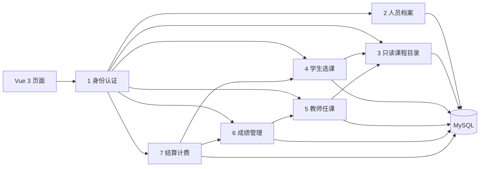
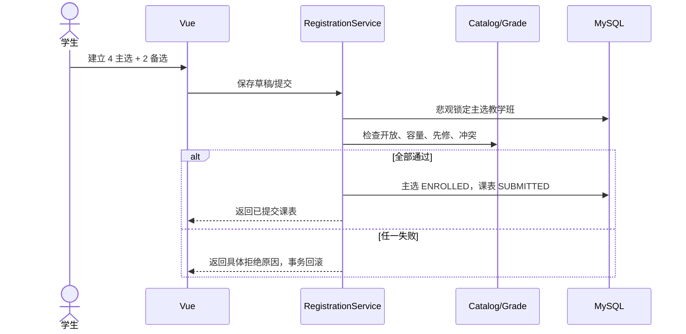

# 架构与关键流程

## 为什么采用模块化单体

课程项目只有 7 人且业务规模有限。一个 Spring Boot 进程能共享事务和数据库，部署简单；七个业务包又能形成清晰所有权。若拆成微服务，会额外引入服务发现、分布式事务、网关和多进程部署，反而削弱需求实现质量。

## 学生提交课表

## 关闭选课的固定顺序

1. 拒绝重复关闭。
2. 取消无人任教教学班并释放其占位。
3. 仅对已提交课表按优先级尝试备选补位。
4. 统计人数，取消少于 3 人的教学班。
5. 冻结课表；草稿不计费。
6. 按仍有效的已选课程汇总学费。
7. 教学班设为 CLOSED、窗口设为关闭。

这一顺序是业务不变量：若先判断最低人数再补位，会错误取消本可达到 3 人的课程；若草稿也计费，会向未提交学生收费。

## 关键安全与并发边界

- 角色权限由 Spring Security 后端执行，隐藏前端按钮不是安全措施。
- 学生接口不接受任意 `studentId`，而是从登录账号取关联人员。
- 教师名单和成绩都先验证教学班所有权。
- 主选提交用数据库悲观锁串行化同一教学班容量检查，避免并发超卖。
- 证件号码写入数据库但绝不原样返回页面。
